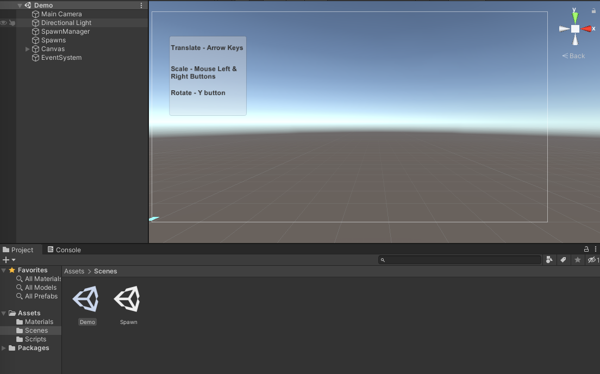

# Playbook Demo
MacOS build only.

## Run as User
1. Clone the repo: `git clone https://github.com/KiraCorbett/playbook.git`
2. Double click the `Demo.zip` and `Spawn.zip` to extract the directories.
3. Double click `Demo.app` to open as Unity game.

## Run as Developer
1. Clone the repo: `git clone https://github.com/KiraCorbett/playbook.git`
2. Ensure that you are using Unity version 2020.3.8 or higher.
3. Open the Unity environment and locate the project to open it.
4. Double-click on the scene you wish to Demo. The "Demo" scene contains object manipulation. The "Spawn" scene instatiates objects.
5. Click the "Play" button to run Unity in Game Mode.

## Notes
- The Spawn scene was the initial development code for spawning cubes into the scene from a 3D button. 
- Rotation is not complete; was having issues getting the x and y quaternion values. For the sake of the demo, the rotation only rotates along the y-axis. I believe that using Quaternions for a simulation of precise rotation would provide value rather than using Rotational functions built into Unity. A lot of Unity methods can "fake" physics which works for most games but when working with manipulation sometimes precise points are valuable. See more notes in Rotation.cs.
- For sake of the demo, user experience and use cases were not considered. 

## Future
I have always wanted to create a view cube in Unity to mimic the movement Gizmos in Unity scenes. My initial idea was to create a mimic rotational gizmo in Fusion 360 then import it in Unity as a mesh so that rotation can take place along the x, y, and z axes in an intuitive way for the user. Some neat things I would consider expanding on after basic rotation include:

